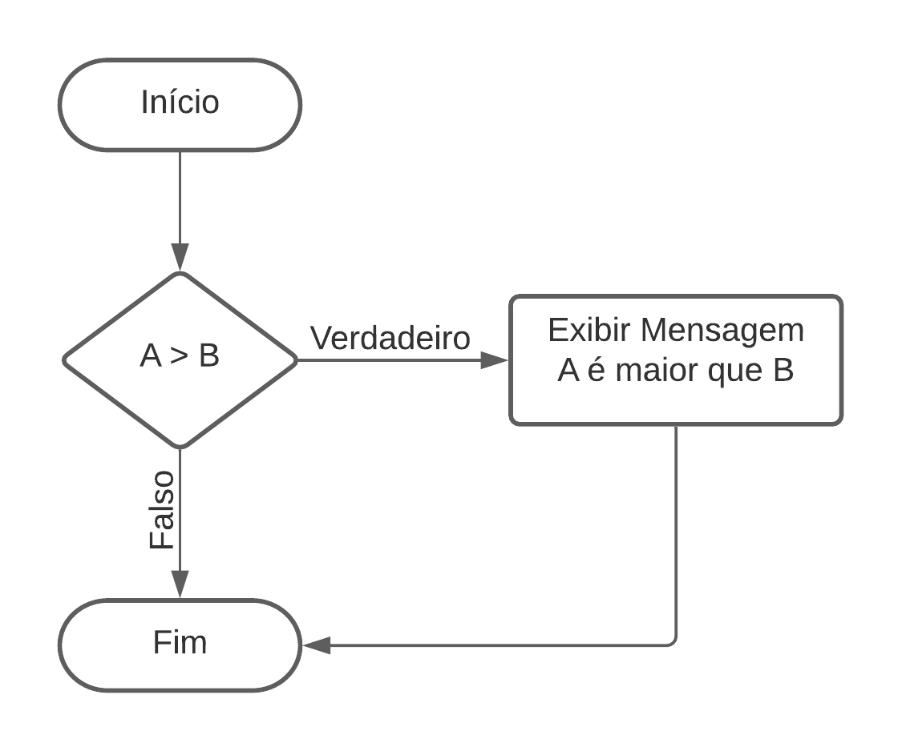
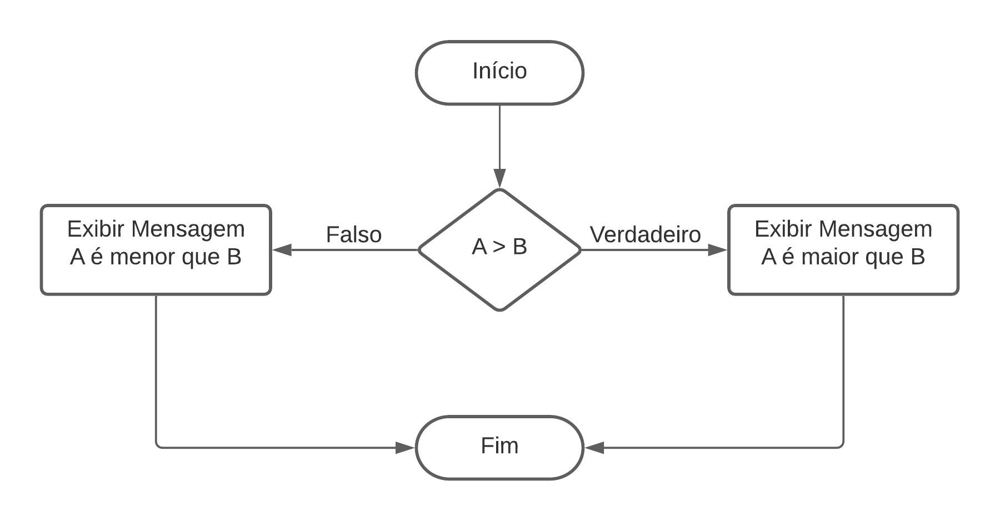

## Estruturas condicionais simples (SE – IF)
Primeiramente, uma estrutura condicional é baseada em uma condição que se for atendida o algoritmo toma uma decisão. Nós podemos representar uma estrutura condicional conforme o algoritmo abaixo.

    SE (a > b) ENTÃO
        Exibir mensagem "o número A é maior que o número B".
    FIM SE

Note que o código acima representa a seguinte condição: se o número A for maior que o número B, o algoritmo irá entender que a condição é verdadeira e deve exibir a mensagem “o número A é maior que o número B”, se esta condição não for atendida, ou seja, se ela for falsa, o algoritmo não irá tomar nenhuma ação, pois ela não atende a condição.

## Estruturas condicionais composta (SENÃO – ELSE)
A diferença em relação a estrutura condicional simples é que se a condição for falsa nosso algoritmo também irá tomar uma ação neste caso, seguindo o exemplo anterior:

    SE (a > b) ENTÃO
        Exibir mensagem "o número A é maior que o número B".
    SENÃO
        Exibir mensagem "o número A é menor que o número B".

Note que o código acima representa a seguinte condição: se o número A for maior que o número B, o algoritmo irá entender que a condição é verdadeira e deve exibir a mensagem “o número A é maior que o número B”, se esta condição não for atendida, ou seja, se ela for falsa.

Diferente do exemplo sobre estrutura condicional simples onde o algoritmo não tomava nenhuma ação, aqui ele toma uma decisão diferente, exibindo a mensagem “o número A é menor que o número B”.

    
   
