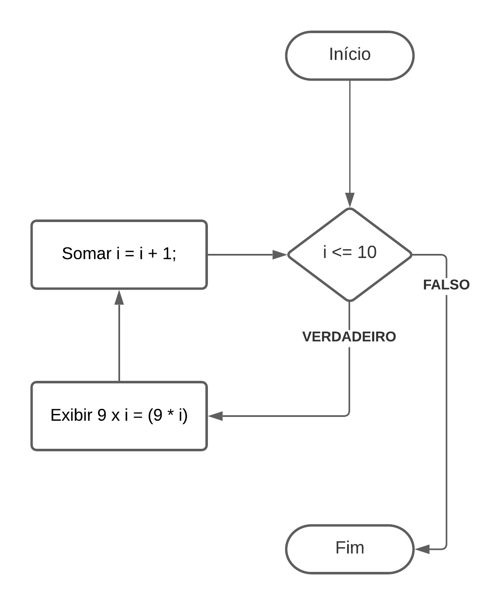

## Estruturas de repetição
Para situações que será necessário repetir uma tarefa mais de uma vez podemos contar com as estruturas de repetição.

### ENQUANTO (While)
Uma das condições que podemos usar é o enquanto, ou seja, enquanto a expressão booleana for verdadeira o algoritmo executa o bloco proposto, por fim é necessário que algo dentro do bloco altere a condição.

Podemos exemplificar o uso do enquanto supondo um algoritmo que retorne o resultado de uma tabuada, onde:

i sendo uma variável inteira de valor 1.

    ENQUANTO i ≤ 10
      Exibir "9 x i = (9 * i)"
      Soma i = i + 1;
    FIM DA CONDIÇÃO

Note que a condição que empregamos no algoritmo é de que a variável i irá repetir o bloco até que o valor dela seja igual a 10. Enquanto isso será exibido a mensagem “9 x i = (9 * i)”, a cada linha executada é somado a variável i o valor 1, essa soma é chamada de iteração. Na maioria das linguagens pode-se referenciar a interação com a sintaxe i++ (variável seguida de dois sinais de mais) ou variável = variável + 1.

    

### PARA (FOR)
A condição PARA tem o mesmo principio que utilizar enquanto (while), porém este recurso é mais utilizado quando se sabe o número de iterações da repetição, como listar os valores de um vetor por exemplo, também vale ressaltar a legibilidade do código mais limpo.

Seguindo o exemplo acima da tabuada, o algoritmo esperado será:

    PARA i = 1; i <= 10; i++;
        Exibir "9 x i = (9 * i)"

Note que ao usar o PARA (for) o contador (a variável i) é inicializado e incrementado na própria condição do laço junto a expressão booleana a ser atendida, deixando o código mais limpo e sem a necessidade de criar variáveis adicionais.

No fim o retorno aguardado será o mesmo que do exemplo que utilizamos a do laço enquanto.
