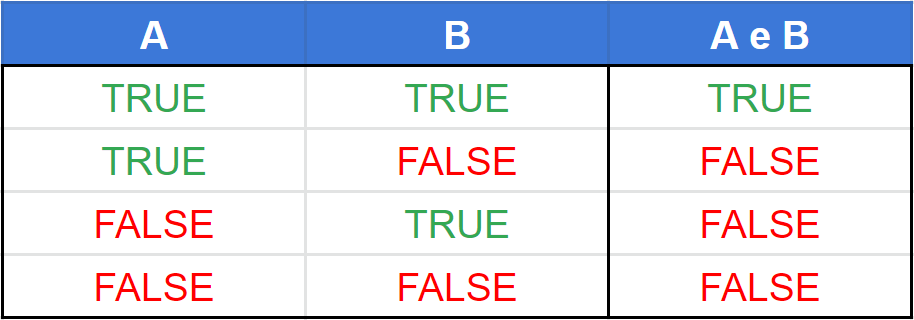
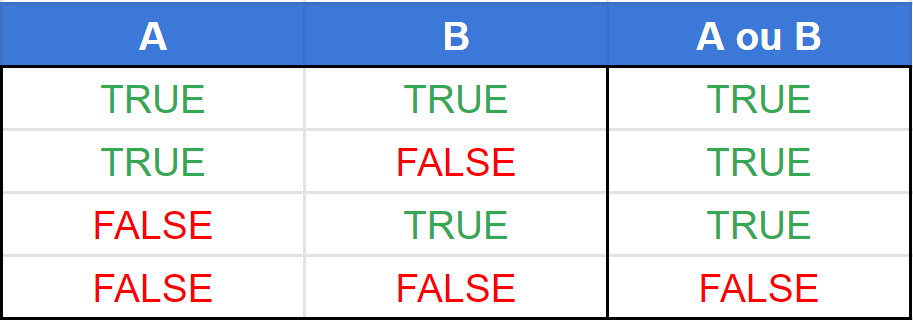
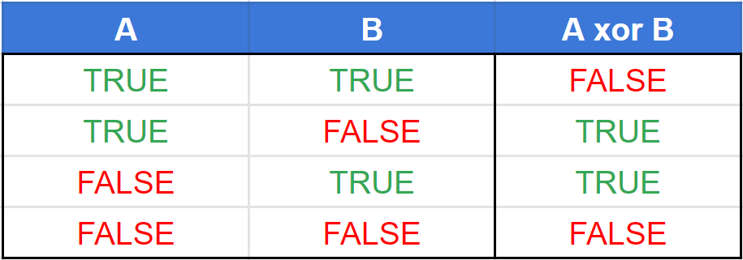
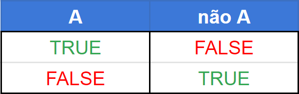

## Valores Booleanos (Verdadeiro e Falso)
Em programação existe um tipo de dado chamado Booleano. Esse tipo guarda uma informação que indica se algo é verdadeiro ou falso. Pensando de maneira abstrata isso parece não fazer muito sentido, porém se pensarmos de maneira um pouco mais concreta facilita as coisas.

Vamos supor que você receba a idade do usuário do seu programa e deseja saber se ela é maior que 18 anos. O resultado da análise da idade só pode retornar dois valores: verdadeiro, se ele tiver mais de 18 anos, ou falso, se ele tiver menos de 18.

No caso acima podemos ter uma visão prática do uso do dado booleano, apesar de não envolver diretamente operadores lógicos.

## Onde entra os operadores lógicos?
Os operadores lógicos entram quando precisamos realizar operações sobre um ou dois valores booleano (verdadeiro ou falso). Vamos pensar de maneira prática novamente. Imagine que agora nós precisamos verificar se a idade do usuário é maior que 18 anos e menor que 22. Pensando em como resolver o problema acima, precisamos realizar 2 comparações, uma para saber se a idade é maior que 18 e outra para saber se a idade é menor que 22.

    _idade maior que 10_
    _idade menor que 22_
    
Sabemos que cada operação dessa retornará um valor verdadeiro ou falso, dependendo da idade do usuário, mas ainda não temos a resposta se a idade está entre 18 e 22. Para realizar essa análise precisamos realizar uma operação sobre os valores booleanos que foram retornados pelas comparações e para isso usamos um operador lógico.

## Operador E (AND)
O primeiro operador lógico que veremos será o operador E. Este operador retorna verdadeiro quando os dois valores de entrada passados para ele são verdadeiros, caso contrário ele retorna falso. Veja a tabela verdade dele abaixo:

  

O operador E pode ser usado para solucionar o problema da idade entre 18 e 22 anos. Podemos fazer do seguinte modo:

_idade maior que 18 E idade menor que 22_

Vamos fazer o teste de mesa para a expressão acima.

Vamos considerar primeiro a idade com valor 15. A primeira condição idade maior que 18 retornará falso, porém idade menor que 22 retornará verdadeira. Aplicando o operador E nos valores falso E verdadeiro temos como resposta o valor falso. Logo sabemos que a idade não está entre 18 e 22 anos.

Vamos considerar agora a idade com valor 20. A primeira condição idade maior que 18 retornará verdadeiro e idade menor que 22 também retornará verdadeira. Aplicando o operador E nos valores verdadeiro E verdadeiro temos como resposta o valor verdadeiro. Logo sabemos que a idade está entre 18 e 22 anos.

Por fim, vamos considerar a idade com valor 30. A primeira condição idade maior que 18 retornará verdadeiro, porém idade menor que 22 retornará falso. Aplicando o operador E nos valores verdadeiro E falso temos como resposta o valor falso. Logo sabemos que a idade não está entre 18 e 22 anos.

## Operador OU (OR)
Este operador retorna verdadeiro quando um ou outro valor de entrada é verdadeiro e também quando os dois valores são verdadeiros. Ele só retorna falso quando os dois valores de entrada são falsos. Veja a tabela verdade dele abaixo:

  

Vamos imaginar que em um sistema precisamos verificar se uma pessoa é esportista ou não. Para isso perguntamos se ela joga futebol OU faz corridas. Nesse caso podemos montar uma expressão assim:

_futebol igual a sim OU corrida igual a sim_

Vamos fazer o teste de mesa:

Se a atividade que a pessoa realiza for somente futebol. A primeira comparação futebol igual a sim retornará verdadeiro, porém a segunda corrida igual a sim retorna falso. Aplicando o operador OU nos valores verdadeiro OU falso teremos o valor verdadeiro. Isso nos indica que temos um esportista.

Se a atividade que a pessoa realiza for somente corrida. A primeira comparação futebol igual a sim retornará falso, porém a segunda corrida igual a sim retornará verdadeiro. Aplicando o operador OU nos valores falso OU verdadeiro teremos o valor verdadeiro. Isso nos indica que temos um esportista.

Se a pessoa realiza as duas atividades futebol e corrida. A primeira comparação futebol igual a sim retornará verdadeiro e a segunda corrida igual a sim retornará verdadeiro. Aplicando o operador OU nos valores verdadeiro OU verdadeiro teremos o valor verdadeiro. Isso nos indica que temos um esportista.

Agora se a pessoa não realiza nenhum das duas atividades. A primeira comparação futebol igual a sim retornará falso e a segunda corrida igual a sim também retornará falso. Aplicando o operador OU nos valores falso OU falso teremos o valor falso. Isso nos indica que não temos um esportista.

## Operador OU Exclusivo (XOR)
O operador OU Exclusivo retornar verdadeiro quando um dos dois valores é verdadeiro, porém retorna falso se os 2 valores forem verdadeiro. Ele também retorna falso se os dois valores de entrada forem falsos.

Veja a tabela verdade abaixo:

  

Note que ele possui o comportamento muito parecido com o OU, porém quando os dois são verdadeiro ele retorna falso.

Vamos supor que precise verificar o regime de trabalho de um professor. Ele pode ser regime exclusivo ou regime parcial, mas não podem ser os dois juntos.

## Operador NÃO (NOT)
Esse operador, diferente dos demais que vimos até agora, realiza uma operação sobre um único valor. Se o valor for verdadeiro ele retorna falso e se o valor for falso ele retorna verdadeiro. Ele também é chamado de operador de negação.

Veja a tabela verdade abaixo:

  

Vamos supor que queremos verificar se a idade de uma pessoa NÃO é maior que 18 anos. Para isso podemos fazer algo assim:

NÃO(idade maior que 18)
Vamos ao teste de mesa:

Considerando que a idade da pessoa é 10 anos. A expressão idade maior que 18 retornará falso, aplicando o operador NÃO no valor falso retorna verdadeiro. Isso indica que a idade é menor que 18 anos.

Agora considerando uma idade de 20 anos. A expressão idade maior que 18 retornará verdadeiro, aplicando o operador NÃO o valor verdadeiro será convertido para falso. Isso indica que a idade é maior que 18 anos.

